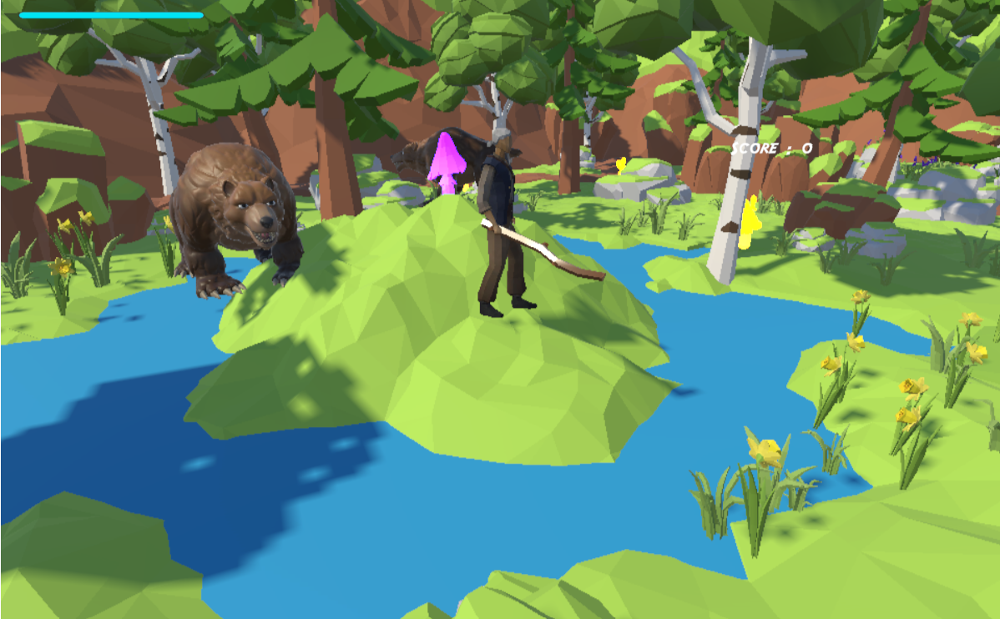

# Bear Forest

## ゲームの内容
・キノコを収集しながら森を進み、ゴールを目指す
・森の中にはクマが動き回っていて、見つかると攻撃してくる
・クマと戦い、体力が0になるとゲームオーバー
・キノコを収集するとスコア獲得、クマを倒すとボーナススコア獲得
※収集できるキノコは黄色と紫色(ピンクに見えるかも?)

## 操作説明
例
・移動：WASDキー(W:前進　S:後退　A:左に進む　D:右に進む)
・視点操作：マウス移動(三人称視点)
・攻撃(木の棒で殴りかかる)：マウス左クリック
・キノコに触れると、自動で収集
